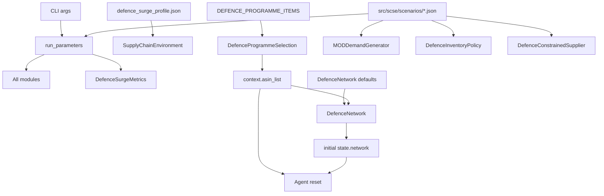

# Inputs

This document enumerates every input consumed by the simulation engine and
explains where each input is defined, validated, and used.

## Input Categories

- Runtime invocation inputs (CLI args)
- Profile configuration (module wiring)
- Scenario configuration (experiment parameters)
- Module constants and defaults
- Derived in-run inputs (context and state keys)

## 1) Runtime Invocation Inputs

Entrypoint: `run_defence_sim.py`

| Argument | Type | Default | Purpose |
|---|---|---|---|
| `--scenario`, `-s` | string | `peacetime_baseline` | Scenario name to load from `src/scse/scenarios/` |
| `--seed` | int | `12345` | Random seed for reproducible stochastic draws |
| `--output-dir`, `-o` | string | `output` | Base output directory |
| `--list-scenarios` | flag | false | Print available scenario names and exit |
| `--quiet`, `-q` | flag | false | Reduce logging verbosity |

How they are consumed:

- Scenario is loaded via `load_scenario()`.
- Scenario `time_horizon` is read and used for environment construction.
- Seed, horizon, and scenario are passed through `run_parameters` to all
  modules and metrics.

## 2) Profile Configuration Input

File: `src/scse/profiles/defence_surge_profile.json`

Purpose: defines the module and metrics class list for this simulation mode.

Schema:

```json
{
  "name": "string",
  "description": "string",
  "modules": ["python.class.path", "..."],
  "metrics": ["python.class.path"]
}
```

Notes:

- Metrics list must resolve to exactly one module in current controller.
- Module ordering controls execution order for Agent actions.

## 3) Scenario Configuration Inputs

Directory: `src/scse/scenarios/`

Each scenario is a JSON file loaded by scenario name.

Canonical schema:

```json
{
  "name": "short_sharp_surge",
  "description": "text",
  "time_horizon": 52,
  "demand": {
    "baseline_multiplier": 1.0,
    "surge_multiplier": 3.0,
    "surge_trigger_week": 12,
    "surge_duration_weeks": 12,
    "post_surge_multiplier": 1.5
  },
  "suppliers": {
    "disruption_probability": 0.05,
    "forced_disruptions": {
      "SubTierSupplierC": {
        "start_week": 14,
        "end_week": 26
      }
    }
  },
  "logistics": {
    "transit_time_multiplier": 2.0,
    "transit_disruption_start_week": 12,
    "transit_disruption_end_week": 30
  }
}
```

Field behavior details:

- `time_horizon`: total number of timesteps (weeks).
- Demand block:
  - baseline period: before `surge_trigger_week` or when trigger is `null`
  - surge period: `[trigger, trigger + duration)`
  - post-surge period: all remaining weeks
- Supplier block:
  - forced disruption windows are half-open intervals
    `[start_week, end_week)`
  - stochastic disruption applies every week using probability draw
- Logistics block:
  - multiplier applies only if current week is in disruption window
  - otherwise effective multiplier is `1.0`

## 4) Module Constant Inputs

These are code-level constants that influence behavior even if scenario values
stay unchanged.

### 4.1 Programme Item Definitions

Source: `scse.modules.selection.defence_programme_selection`

`DEFENCE_PROGRAMME_ITEMS` fields per item:

- `id` (dict key): item identifier (e.g., `PGM-001`)
- `name`: human label
- `family`: product family
- `base_weekly_demand`: baseline demand intensity
- `priority`: lower number means higher fulfillment priority
- `unit_cost`: informational item cost field
- `critical_component`: label for constrained component type

### 4.2 Network Defaults

Source: `scse.modules.topology.defence_network`

- initial component inventory per item at factory
- initial finished-goods inventory per item at factory
- factory weekly production capacity
- supplier node attributes:
  - `base_lead_time`
  - `lead_time_variability`
  - `weekly_capacity`

### 4.3 Demand Module Parameters

Source: `scse.modules.customer.defence_mod_demand`

- demand noise range: uniform `[0.8, 1.2]`
- demand quantity lower bound: `max(1, round(...))`

### 4.4 Fulfillment Module Parameters

Source: `scse.modules.fulfillment.defence_priority_fulfillment`

- production headroom factor used for per-item production cap

### 4.5 Buying Policy Parameters

Source: `scse.modules.buying.defence_inventory_policy`

- default safety stock weeks
- surge threshold and surge safety stock multiplier
- expedite threshold fraction

### 4.6 Supplier Module Parameters

Source: `scse.modules.vendor.defence_constrained_supplier`

- expedite lead-time reduction factor (~40%)
- supplier routing strategy (first supplier with edge to destination)

### 4.7 Metrics Parameters

Source: `scse.metrics.defence_surge_metrics`

- fulfillment reward per unit
- procurement cost per unit
- expedite premium
- holding cost per unit-week

## 5) Derived Runtime Inputs: Context

Context is static per run and comes from Env modules.

| Key | Producer | Type | Meaning |
|---|---|---|---|
| `asin_list` | `DefenceProgrammeSelection.get_context()` | list[string] | Active programme item IDs |

This context is passed to `reset(context, state)` for Agents and metrics.

## 6) Derived Runtime Inputs: State

State is mutable and evolves during run.

Top-level state keys at initialization:

- `clock` (int)
- `date_time` (datetime)
- `customer_orders` (list[order])
- `purchase_orders` (list[order])
- `network` (DiGraph from `DefenceNetwork`)

### Order Entity Fields

`customer_order` and `purchase_order` include:

- `type`
- `asin`
- `quantity`
- `schedule`
- optional `uuid`
- additional fields by module (`destination`, `expedite`, `programme_priority`)

### Shipment Action Fields

`inbound_shipment` and `outbound_shipment` include:

- `type`
- `asin`
- `origin`
- `destination`
- `quantity`
- `schedule`
- optional `uuid`
- optional `lead_time_override`
- optional `expedite`

## Input Dataflow Diagram


