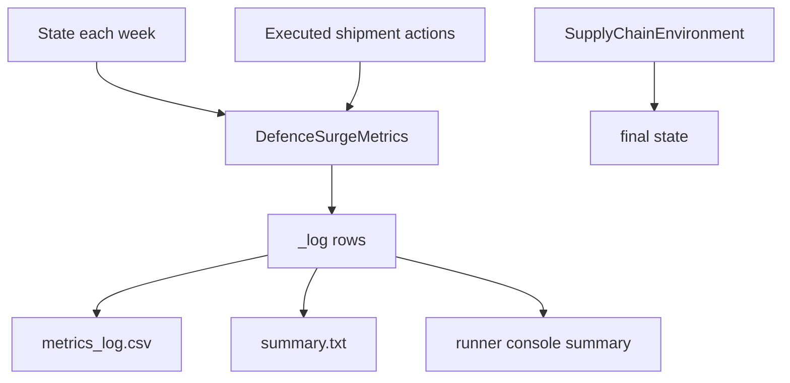

# Outputs

This document describes every output artifact produced by the simulation engine
and explains how each value is generated.

## Output Categories

- In-memory outputs returned by runtime calls
- Persistent file outputs written by metrics
- Console output emitted by runner

## 1) In-Memory Runtime Outputs

### 1.1 `env.run()` Return Value

`SupplyChainEnvironment.run()` returns final simulation state.

Top-level keys in returned state:

- `clock`: final timestep counter (equals horizon)
- `date_time`: datetime after final increment
- `customer_orders`: remaining unfulfilled orders (backlog representation)
- `purchase_orders`: remaining unprocessed or partially carried orders
- `network`: final graph with node inventories and edge shipments
- module-contributed keys where applicable

### 1.2 Metrics In-Memory Log

`DefenceSurgeMetrics` stores per-week records in `_log`.

Each row includes:

- `week`
- `total_demanded`
- `total_fulfilled`
- `fill_rate`
- `backlog`
- `fg_inventory`
- `component_inventory`
- `production`
- `utilisation`
- `expedite_orders_cumulative`
- `expedite_units_cumulative`
- `holding_cost`

## 2) File Outputs

Written by `DefenceSurgeMetrics.write_output()`.

Base path:

- `<output_dir>/<scenario_name>/`

Artifacts:

- `metrics_log.csv`
- `summary.txt`

### 2.1 `metrics_log.csv`

Per-week time-series of operational metrics.

| Column | Type | Definition |
|---|---|---|
| `week` | int | Simulation week index at logging time |
| `total_demanded` | int | Cumulative demanded units = fulfilled + current backlog |
| `total_fulfilled` | int | Cumulative fulfilled units |
| `fill_rate` | float | `total_fulfilled / total_demanded` |
| `backlog` | int | Sum of quantities in remaining customer orders |
| `fg_inventory` | int | Total finished-goods inventory at factory across items |
| `component_inventory` | int | Total component inventory at factory across items |
| `production` | int | Units produced this week at factory |
| `utilisation` | float | `production / weekly_capacity` |
| `expedite_orders_cumulative` | int | Running count of expedited inbound shipments |
| `expedite_units_cumulative` | int | Running count of expedited inbound units |
| `holding_cost` | float | `(fg_inventory + component_inventory) * holding_cost_per_unit_week` |

### 2.2 `summary.txt`

Human-readable final metrics snapshot and peaks:

- scenario name
- simulation horizon
- final cumulative demand and fulfillment
- final fill rate and backlog
- final finished/component inventory
- cumulative expedite totals
- peak backlog
- minimum fill rate
- peak utilization

## 3) Console Output

The runner prints:

- simulation header (scenario, description, horizon, seed)
- output directory path after write
- final summary block with key headline values

This output mirrors key values in `summary.txt` for quick inspection.

## 4) Reward Stream (Internal Output)

The controller expects reward output from metrics:

- Shipment actions return scalar reward values.
- `advance_time` returns reward dictionary:
  - `total`
  - `by_asin`

This reward stream is used by controller bookkeeping (`timestep_reward`,
`episode_reward`) and is part of engine internals rather than an external
artifact.

## Output Dataflow Diagram

