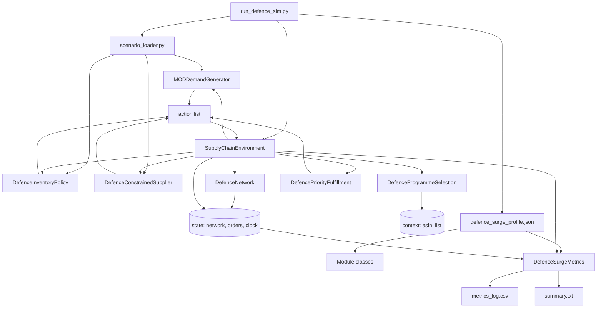

# Simulation Engine Overview

## Purpose

The defence simulation engine models how a fictional UK prime contractor supply
chain behaves under changing demand and disruption regimes. A run is configured
by a profile, a scenario, and runtime arguments. The engine then advances in
discrete weekly timesteps and emits operational performance metrics.

This engine is implemented in Python under `src/scse/` and is executed through
`run_defence_sim.py`.

## Main Building Blocks

- Controller: `scse.controller.miniscot.SupplyChainEnvironment`
- Profile loader and class instantiation: `scse.profiles.profile`
- Scenario loader and scenario utility functions: `scse.scenarios.scenario_loader`
- Pluggable modules:
  - Env modules contribute static context and initial state
  - Agent modules read state and emit actions each timestep
  - Metrics module computes rewards and writes output artifacts

## Defence Profile Module Stack

The profile `defence_surge_profile` wires modules in this order:

1. `DefenceProgrammeSelection` (Env)
2. `DefenceNetwork` (Env)
3. `MODDemandGenerator` (Agent)
4. `DefencePriorityFulfillment` (Agent)
5. `DefenceInventoryPolicy` (Agent)
6. `DefenceConstrainedSupplier` (Agent)
7. `DefenceSurgeMetrics` (Metrics)

The order matters for Agent modules because actions are computed and executed in
sequence within each timestep.

## High-Level Architecture

## Simulation Model at a Glance

- Time model: weekly discrete steps (`time_increment='weekly'`)
- Network model: directed graph (`networkx.DiGraph`) with node and edge
  attributes, including in-transit shipment lists on edges
- Demand model: per-item weekly demand with scenario multiplier and random noise
- Supply model: constrained supplier dispatch, disruption checks, variable lead
  times, optional expedite behavior
- Production model: component-to-finished conversion at factory with capacity cap
- Allocation model: fulfill customer orders by programme priority and FIFO tie
  break
- Performance model: cumulative fill rate, backlog, inventory, utilization,
  expedite counts, holding cost proxy

## Fictional Data Notice

Names, quantities, locations, and all outputs are fictional simulation values.
