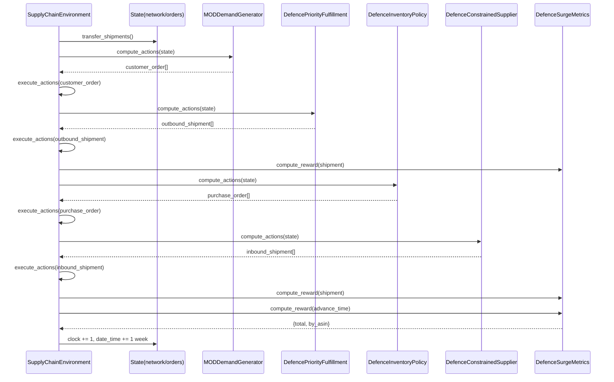
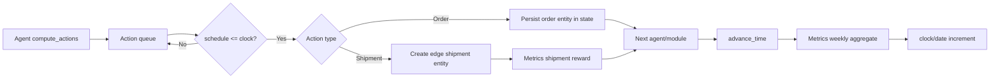

# Runtime Flow

## Entry and Setup

The defence run entrypoint is `run_defence_sim.py`.

1. Parse CLI arguments:
   - `--scenario`
   - `--seed`
   - `--output-dir`
   - `--list-scenarios`
   - `--quiet`
2. Load the selected scenario JSON.
3. Read `time_horizon` from scenario unless overridden by args.
4. Create `SupplyChainEnvironment` with profile `defence_surge_profile`.

At initialization, the controller:

1. Loads profile JSON.
2. Instantiates exactly one metrics module.
3. Instantiates the ordered list of modules.

## Initial Environment Construction

Before timestep execution, `get_initial_env_values()` performs:

1. Create base state:
   - `clock = 0`
   - `date_time = start_date`
   - `customer_orders = []`
   - `purchase_orders = []`
2. Run all Env modules for static context (`get_context`).
3. Run all Env modules for initial state (`get_initial_state(context)`).

For the defence profile this yields:

- `context['asin_list']`: programme item IDs
- `state['network']`: defense network graph

Then `reset_agents(context, state)` runs for each Agent plus metrics reset.

## Timestep Execution Order

For each timestep until `time_horizon`:

1. Transfer shipments already on network edges (`_transfer_shipments`)
2. Iterate Agent modules in profile order
3. After each Agent computes actions, execute all due actions
4. Advance time (`_advance_time`) and compute end-of-week metrics

### Action Execution Rules

When `_execute_actions` handles an action with `schedule <= clock`:

- `customer_order` or `purchase_order`
  - persisted into `state['customer_orders']` or `state['purchase_orders']`
- `inbound_shipment`, `outbound_shipment`, or `transfer`
  - converted into edge shipment entities with `time_until_arrival`
  - metrics receives immediate shipment reward signal
- unknown type
  - raises `ValueError`

Actions scheduled for future timesteps stay queued.

### Shipment Transfer Rules

At each timestep start, every shipment on each edge decrements
`time_until_arrival` by 1. On arrival:

- if destination has `component_inventory` and origin is `vendor`, quantity is
  added to destination component inventory
- else if destination has regular `inventory`, quantity is added there
- else destination is treated as customer delivery sink (`delivered` counters)

## Defence Agent Responsibilities Per Week

1. `MODDemandGenerator`
   - emits `customer_order` per item using scenario demand multiplier
2. `DefencePriorityFulfillment`
   - produces finished goods from components subject to factory weekly capacity
   - fulfills customer orders by programme priority
3. `DefenceInventoryPolicy`
   - computes inventory position and emits `purchase_order`
   - sets `expedite` when critically low
4. `DefenceConstrainedSupplier`
   - maps PO to suppliers
   - applies disruption logic and capacity limits
   - emits `inbound_shipment` with lead-time override

## End-of-Run Behavior

After the loop:

1. `env.run()` returns final state
2. runner calls `metrics.write_output()`
3. files written to `output/<scenario>/`:
   - `metrics_log.csv`
   - `summary.txt`
4. final line-item summary is printed to console from last metrics row

## One-Timestep Sequence Diagram

## State/Action Lifecycle Diagram

